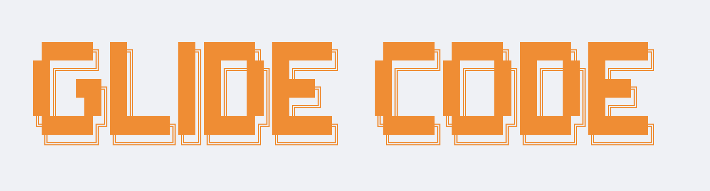
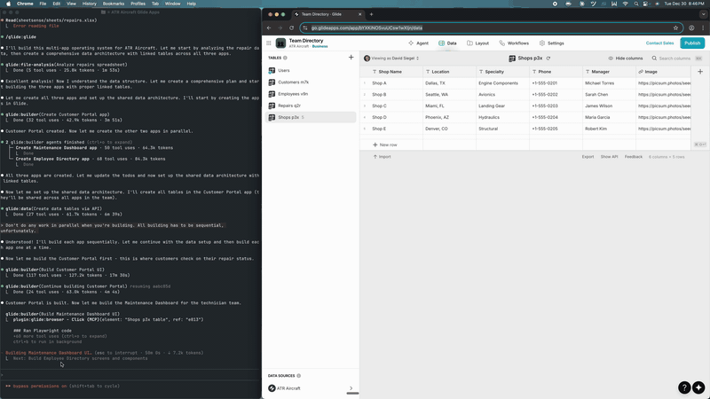

**⚠️ This is highly experimental and will break often. Use at your own risk.**

<picture>
  <source media="(prefers-color-scheme: light)" srcset="media/logo-light.png">
  <source media="(prefers-color-scheme: dark)" srcset="media/logo-dark.png">
  
</picture>

## What is This?

Glide Code is a plugin for [Claude Code](https://docs.claude.com), which gives the world's most popular coding agent the ability to not only build apps and work in Glide, but to do so with many agents in parallel via browser automation and Glide's multiplayer support.

This is a much more powerful (but slower) version of the built-in Agent in Glide today. It's more powerful because it can do everything in the builder, but it's also a general-purpose agent which can do things like analyze files and use the Glide API.

Clip from a 4hr session where Glide Code built 3 apps (sped up 40x):

<p align="center">
  
</p>

## Installation

First, [install Claude Code](https://docs.claude.com) if you don't have it.

```
/plugin marketplace add glideapps/glide-code
/plugin install glide@glide
```

## How to Use

Run the `/glide:start` command with what you want to build or work on:

```
/glide:start Build an app for managing repairs for our construction company. The data is in repairs.csv
```

This will open a browser window where you can sign in to Glide (first time only). Your session will be remembered for future use. Claude will use the appropriate agents to build your app.

You can also kick off a working session with an existing app:

```
/glide:start do a design review on my Repairs app
```

## Development

### Running Scripts

| Script | Purpose |
|--------|---------|
| `./scripts/start` | Run plugin from installed/cloned repo (from any directory) |
| `./scripts/dev` | Run plugin for local development (run from repo root) |

When working on the plugin itself, use `scripts/dev` from the repository root. This loads the plugin from the current directory, so changes to agents, skills, and commands are reflected immediately.

```bash
git clone git@github.com:glideapps/glide-code.git
cd glide-code
./scripts/dev
```

Alternatively, point [Claude Code](https://docs.claude.com) to the local directory:

```bash
claude --plugin-dir /path/to/glide-code/glide
```

## Build Workflow

1. **Clarify use case** - Understand what you want to build
2. **Create app** - Start a blank app in Glide Builder
3. **Analyze file** (if provided) - Extract data structure from spreadsheets
4. **Create tables via API** - Import data using the Glide API
5. **Build screens** - Design the UI with Playwright automation
6. **Design review** - Critique and improve screen layouts
7. **QA verification** - Verify features actually work
8. **Finalize** - Configure access and publish

## Commands

| Command | Purpose |
|---------|---------|
| `/glide:start` | Guided setup - interactive login, choose app, select task |
| `/tip` | Provide expert guidance - plugin learns and updates skills |

## Agents

| Agent | Purpose |
|-------|---------|
| **build** | Creates apps and builds screens via browser automation |
| **data** | Creates tables and imports data via Glide API |
| **file-analysis** | Analyzes spreadsheets to extract data models |
| **design-review** | Critiques screens for design quality on mobile/desktop |
| **qa** | Verifies features work before declaring the app ready |
| **app-research** | Explores existing apps to document structure |

## Skills

| Skill | Purpose |
|-------|---------|
| **glide** | Main workflow, agent coordination, builder navigation |
| **design** | Screen structure, component selection, layout patterns |
| **templates** | Browse Template Store for design inspiration |
| **data-modeling** | Tables, columns, relationships |
| **computed-columns** | Math, If-Then-Else, Relations, Rollups |
| **ai** | AI columns (Generate Text, Audio to Text, etc.) |
| **api** | Glide API v2 usage |
| **app-sharing** | Privacy settings and authentication |
| **browser** | Multi-browser coordination for parallel work |

## Concurrent Operations

The plugin supports up to 6 parallel browser sessions, enabling multiple agents to work simultaneously on the same app. Glide is multiplayer-enabled, so concurrent edits work seamlessly.

**Use cases:**
- Build multiple screens in parallel
- Design review while building continues
- QA verification alongside fixes

**How it works:**
- Run `/glide:start` once to authenticate and copy profile to all browsers
- Spawn agents with browser assignments: "Build Tasks screen using browser 1"

## Prerequisites

1. **Glide Account** - Sign in at [go.glideapps.com](https://go.glideapps.com)
2. **Playwright MCP** - Browser automation (configured in plugin)

## First Time Setup

1. Start [Claude Code](https://docs.claude.com) with the plugin installed
2. Run `/glide:start` to begin setup
3. Complete interactive login in the browser window
4. Choose whether to create a new app or edit an existing one
5. Select what you want to do (build screens, import data, etc.)
6. The plugin handles authentication and profile setup automatically

