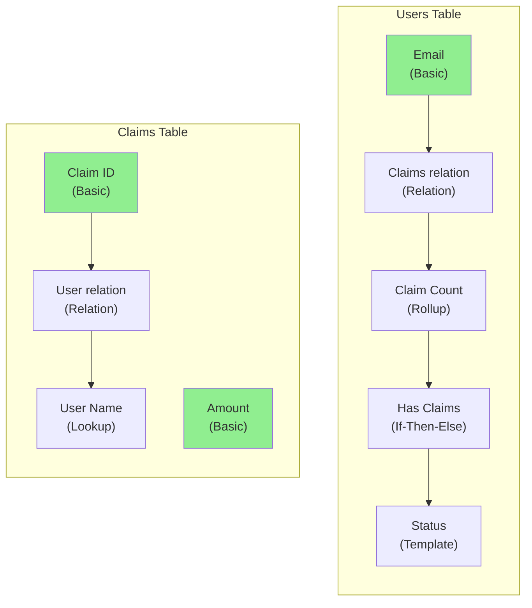

# Glide App Audit Report

**App**: [App Name]
**App ID**: [App ID]
**Audit Date**: 2026-01-12

---

## Executive Summary

This report analyzes app performance based on [Glide's official documentation](https://www.glideapps.com/docs/performance-analysis).

**Key Findings:**
- X columns exceeding 100ms computation time
- X Query columns that could be Relations
- X tables approaching 25,000 row limit

---

## Performance Analysis Results

Columns flagged by Glide's Performance Analysis (>100ms):

| Table | Column | Type | Notes |
|-------|--------|------|-------|
| Users | Status Display | Template | End of 5-column chain |
| Claims | Total Value | Rollup | Large relation |

*Run Performance Analysis in Data Editor to get current timings.*

---

## Column Dependency Diagram



**Legend:**
- Green: Basic columns (no dependencies)
- Arrows show dependency direction

---

## Issues Found

### Query Columns That Could Be Relations

**Source**: [Query Column docs](https://www.glideapps.com/docs/query-column)
> "Query columns are often the source of performance issues. Consider replacing query columns with Conditional Relations."

| Table | Column | Current | Recommendation |
|-------|--------|---------|----------------|
| Services | Related Items | Query on Items table | Convert to Relation |

---

### Tables Approaching Row Limits

**Threshold**: 25,000 rows ([Big Tables Guide](https://www.glideapps.com/docs/guide-to-bigtables))

| Table | Row Count | Status |
|-------|-----------|--------|
| Claims | 22,450 | Approaching limit - plan Big Tables migration |
| Users | 3,200 | OK |
| Services | 890 | OK |

---

### Nested Computed Columns

**Source**: [Performance Analysis docs](https://www.glideapps.com/docs/performance-analysis)
> "Computed columns with dependencies on other computed columns are likely to slow down as they wait for the other columns in the chain to process."

Longest chain found: **Users table, 5 levels**
```
Email → Claims relation → Claim Count → Has Claims → Status
```

**Recommendation**: Check if `Status` column shows ⚠️ in Performance Analysis. If so, consider combining `Has Claims` and `Status` into single column.

---

### Collections

**Threshold**: 24 items visible at once ([Build for Speed](https://www.glideapps.com/blog/build-speed-and-scale))

| Screen | Collection | Items | Status |
|--------|------------|-------|--------|
| Claims List | All Claims | 50 | Add pagination |
| Dashboard | Recent | 10 | OK |

---

## Recommendations

### Priority 1: Check Performance Analysis
1. Open Data Editor
2. Click Performance Analysis
3. Focus on columns showing ⚠️ (>100ms)

### Priority 2: Convert Query to Relation
- `Services.Related Items` should be a Relation
- This is Glide's recommended optimization

### Priority 3: Plan for Big Tables
- `Claims` table at 22,450 rows
- Limit is 25,000 for Glide Tables
- Review [Big Tables limitations](https://www.glideapps.com/docs/big-tables) before migrating

### Priority 4: Add Pagination
- `Claims List` screen shows 50 items
- Glide recommends max 24 visible at once

---

## Reference Links

- [Performance Analysis](https://www.glideapps.com/docs/performance-analysis) - 100ms threshold
- [Query Column Limits](https://help.glideapps.com/en/articles/12063345-understanding-query-column-limits-in-glide-apps) - 10,000 entries
- [Big Tables Guide](https://www.glideapps.com/docs/guide-to-bigtables) - 25,000 row limit
- [Build for Speed and Scale](https://www.glideapps.com/blog/build-speed-and-scale) - 24 items, 1500px images
- [Performance Tips (Community)](https://community.glideapps.com/t/app-performance-tips-tricks-speed/73139)

---

*Report generated by Glide App Audit*
