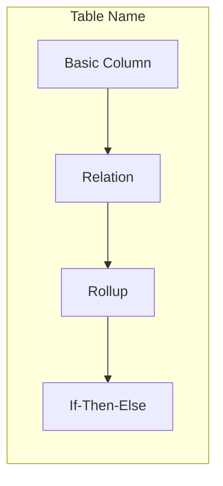

# Glide App Performance Audit

You are performing a comprehensive performance audit of a Glide application.

## Task

Analyze the provided Glide app for performance issues and optimization opportunities.

**App URL**: $ARGUMENTS

## Official Glide Thresholds

Use these documented thresholds from Glide:

| Metric | Threshold | Action |
|--------|-----------|--------|
| Column computation | >100ms | Flag as slow (Performance Analysis warning) |
| Query column entries | >10,000 | Recommend restructuring |
| Glide Table rows | >25,000 | Requires Big Tables |
| Big Table rollup matches | >100 | Hits Big Table limit |
| Collection items | >24 visible | Recommend pagination |
| Image size | >1,500px | Recommend compression |

## What to Look For

### Critical Issues
- **Query on same table** - Can crash app, always flag
- **Tables over 25,000 rows** - Must migrate to Big Tables
- **Columns showing >100ms in Performance Analysis** - Needs optimization

### Performance Anti-Patterns (from Glide docs)
- **Query columns** - Slower than Relations for Glide Tables
- **Nested computed columns** - Cause cascading delays with large data
- **Filtering/sorting on computed columns** - Forces full table recalculation
- **Large collections without pagination** - Heavy rendering

### Data to Collect
- Row counts per table (check vs 25,000 limit)
- Query columns that could be Relations
- Computed column dependency chains
- Performance Analysis results (which columns show ⚠️)

## Workflow

### Phase 1: Connect to App
1. Parse app URL to extract App ID
2. Navigate to app Data Editor
3. Extract API token via "Show API" panel

### Phase 2: Run Performance Analysis
1. In Data Editor, click Performance Analysis
2. Document all columns showing ⚠️ (>100ms)
3. These are the priority columns to investigate

### Phase 3: Data Structure Analysis

**Via API:**
- Fetch tables for row counts
- Check which tables approach 25,000 limit

**Via Browser:**
- Inspect computed columns (API doesn't expose them)
- Identify Query columns - could they be Relations?
- Check for queries on same table (critical)
- Trace dependencies between computed columns

**Via Dev Tools** (if available - Glide internal only):
- Get complete dependency analysis with depth
- Export column dependency data

### Phase 4: Layout Analysis
1. Navigate to Layout Editor
2. Check collection configurations:
   - How many items displayed?
   - Is pagination enabled?
3. Note large image usage
4. Check first screen weight

### Phase 5: Generate Report

Include:
1. **Columns exceeding 100ms** - List from Performance Analysis
2. **Row counts** - Tables near/over limits
3. **Query → Relation opportunities** - Glide recommends this
4. **Dependency diagram** - Mermaid showing computed column chains
5. **Recommendations** - Based on Glide best practices

## Dependency Diagram

Generate a Mermaid diagram showing column relationships:

Show:
- Which columns depend on others
- Types of computed columns
- Chain depth (useful context, but no arbitrary thresholds)

## Safety Requirements

⚠️ **READ-ONLY OPERATIONS ONLY**
- Only use browser navigation and snapshots
- Only use API GET requests
- NEVER click Save, Update, or Confirm buttons
- NEVER modify columns, components, or settings
- If you open an edit dialog, press ESC to close

## Reference Documentation

- [Performance Analysis](https://www.glideapps.com/docs/performance-analysis) - 100ms threshold
- [Query Column Limits](https://help.glideapps.com/en/articles/12063345-understanding-query-column-limits-in-glide-apps) - 10,000 entry limit
- [Build for Speed](https://www.glideapps.com/blog/build-speed-and-scale) - 24 items, 1500px images
- [Big Tables](https://www.glideapps.com/docs/big-tables) - 25,000 row limit for regular tables

## Output

Generate a markdown report with:
- Summary of findings
- Columns exceeding 100ms (from Performance Analysis)
- Tables approaching row limits
- Query columns that could be Relations
- Dependency diagram
- Recommendations citing Glide documentation

Display the report to the user after analysis is complete.
