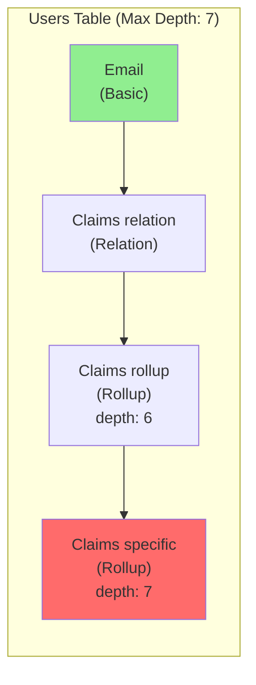

# Glide App Performance Audit

You are performing a comprehensive performance audit of a Glide application.

## Task

Analyze the provided Glide app for performance issues and optimization opportunities.

**App URL**: $ARGUMENTS

## What to Audit

### Data Layer Analysis
- Deep computed column chains (6+ layers → Critical)
- Relation proliferation (5+ relations → Warning)
- Rollups without relations (Critical)
- Heavy AI column usage (3+ → Warning)
- Query column overuse (2+ → Warning)
- Row limit issues (80%+ → Warning)

### Layout Analysis
- Collection field density (10+ fields → Optimization)
- Inline collection overload (3+ → Warning)
- Component overload (20+ → Warning, 30+ → Critical)
- Unoptimized table views (AI columns visible → Warning)

## Workflow

Follow the procedures in `glide/skills/app-audit/`:

1. **Fetch App Data** (`procedures/fetch-app-data.md`)
   - Parse app URL to extract App ID
   - Navigate to app Data Editor
   - Extract API token via "Show API" panel
   - Fetch tables and row counts via API (GET requests only)
   - **Inspect computed columns via browser** (API doesn't expose them)
   - **Trace column dependencies** to build dependency graph

2. **Analyze Data Structure** (`procedures/analyze-data-structure.md`)
   - Build column dependency graphs
   - Detect performance anti-patterns
   - Calculate severity scores
   - Identify critical issues

3. **Analyze Layout** (`procedures/analyze-layout.md`)
   - Navigate to Layout Editor
   - Inspect screens and components
   - Count collection fields and inline collections
   - Flag layout anti-patterns

4. **Generate Report** (`procedures/generate-report.md`)
   - Compile findings by severity
   - Calculate performance score (0-100)
   - Generate markdown report with:
     - Executive summary
     - Critical issues (🔴)
     - Warnings (🟡)
     - Optimizations (🟢)
     - Performance score breakdown
     - Priority actions

## Data Inspection Methodology

### Required: API + Browser Inspection

You MUST use BOTH API and Browser inspection for a complete audit:

| Method | Purpose | What It Reveals |
|--------|---------|-----------------|
| **API (Show API panel)** | Get table list, row counts, basic column types | Text, Number, Date, Boolean columns only |
| **Browser (Data Editor)** | Inspect computed columns, trace dependencies | Math, If-Then-Else, Relations, Rollups, Lookups, AI columns, Templates |

**The Glide API does NOT expose computed columns.** An API-only audit will miss:
- Computed column chains (the #1 performance issue)
- Relation proliferation
- Rollup misconfigurations (rollup on table vs relation)
- AI column overuse

**Manual inspection steps for computed columns:**
1. Click on each table in the Data Editor
2. Look at column headers to identify computed columns (formula icons)
3. Click computed columns to see their configuration panel
4. Trace dependencies: if a computed column references another computed column, follow the chain
5. Count the depth of the deepest chain (4+ layers = warning, 6+ = critical)
6. **Build a dependency graph** for the report (see below)

### Optional: Dev Tools Plugin

If you have access to the **Dev Tools plugin** (limited to select Glide internal users), it can provide instant column dependency analysis with depth calculations. Look for the "Dev tools" button in the top-right toolbar.

### Dependency Diagram Requirement

The audit report MUST include a **Mermaid diagram** showing column dependencies:

**Diagram requirements:**
- Group columns by table using subgraphs
- Show dependency direction (basic → computed)
- Include column type in labels
- Show depth for computed columns
- Color-code: green for basic columns, red for critical depth (6+), yellow for warnings (4-5)

## Important Safety Notes

⚠️ **READ-ONLY OPERATIONS ONLY**
- Only use browser navigation and snapshots (READ operations)
- Only use API GET requests (NO POST/PATCH/PUT/DELETE)
- NEVER click Save, Update, or Confirm buttons
- NEVER modify columns, components, or settings
- If you accidentally open an edit dialog, press ESC to close

The app must remain exactly as it was before the audit.

## Reference Documentation

- **[Analysis Patterns](glide/skills/app-audit/analysis-patterns.md)** - Detailed anti-pattern descriptions
- **[Recommendations](glide/skills/app-audit/recommendations.md)** - Fix strategies for each issue type
- **[Main Skill](glide/skills/app-audit/SKILL.md)** - Full audit documentation

## Output

Generate a comprehensive markdown report with:
- Overall health status and score
- Issues grouped by severity
- Specific locations (table names, screen names)
- Performance impact explanations
- Actionable recommendations with steps to fix
- Priority action list

Display the report to the user after analysis is complete.
