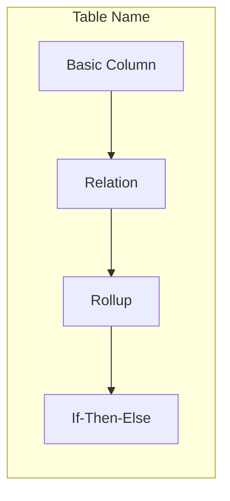

# Glide App Audit

Comprehensive performance audit tool for Glide applications. Analyzes data architecture and layout design to identify bottlenecks, anti-patterns, and optimization opportunities.

## ⚠️ Read-Only Guarantee

**This tool is 100% read-only and NEVER modifies your app:**
- ✅ Reads data via API (GET requests only)
- ✅ Navigates through Layout Editor to inspect screens
- ✅ Takes snapshots to analyze components
- ✅ Clicks to view settings panels (read-only)
- ❌ NEVER edits columns, components, or settings
- ❌ NEVER adds or deletes anything
- ❌ NEVER saves any changes
- ❌ NEVER modifies data or structure

**Safe to run anytime** - Your app remains exactly as it was before the audit.

## Official Glide Performance Thresholds

These thresholds come directly from [Glide documentation](https://www.glideapps.com/docs/performance-analysis) and [community guidance](https://community.glideapps.com/t/app-performance-tips-tricks-speed/73139):

| Metric | Threshold | Source |
|--------|-----------|--------|
| **Column computation time** | 100ms | [Performance Analysis](https://www.glideapps.com/docs/performance-analysis) - columns exceeding this show ⚠️ |
| **Query column entries** | 10,000 max | [Query Column Limits](https://help.glideapps.com/en/articles/12063345-understanding-query-column-limits-in-glide-apps) |
| **Glide Table rows** | 25,000 max | [Big Tables Guide](https://www.glideapps.com/docs/guide-to-bigtables) |
| **Big Table rows** | 10 million max | [Big Tables](https://www.glideapps.com/docs/big-tables) |
| **Big Table rollup/lookup matches** | 100 max | [Big Tables](https://www.glideapps.com/docs/big-tables) |
| **Collection items visible** | 24 recommended | [Build for Speed](https://www.glideapps.com/blog/build-speed-and-scale) |
| **Image dimensions** | 1,500px max | [Build for Speed](https://www.glideapps.com/blog/build-speed-and-scale) |

### Big Table Computed Column Limits

Big Tables use SQL (AlloyDB) for queries. Only certain computed columns can be filtered/sorted:

**Supported for filtering/sorting in Big Tables:**
- Math columns
- If-Then-Else columns
- Lookup columns (single relation, basic columns only)
- Template columns (static template only)

**NOT supported for filtering/sorting in Big Tables:**
- Rollup columns
- Multi-relation columns
- Query columns
- Plugin-based columns

See [analysis-patterns.md](analysis-patterns.md) for detailed requirements.

## What It Audits

### Data Layer Analysis

**Using Glide's Performance Analysis tool:**
- Run Performance Analysis in the Data Editor
- Identify columns with ⚠️ warning (>100ms computation)
- Focus on those specific columns for optimization

**Using Dev Tools plugin** (Glide internal users only):
- **Column Dependencies** - Complete dependency graph with depth calculations
- **Max Depth** - Deepest computed column chain in the app
- **Access Control** - Row Owner and Role columns
- **User Specific Columns** - Per-user data storage
- **Table Row Counts** - Accurate counts with CSV export

**Known performance anti-patterns** (from Glide docs):
- **Query columns** - [Slower than Relations](https://www.glideapps.com/docs/query-column) for Glide Tables
- **Query on same table** - Can crash the app ([source](https://www.glideapps.com/blog/build-speed-and-scale))
- **Nested computed columns** - Cause slowdowns with large datasets
- **Filtering on computed columns** - Forces entire table recalculation
- **Tables approaching 25,000 rows** - Need Big Tables migration

### Layout Analysis
- **Collection item counts** - More than 24 items hurts performance
- **Image sizes** - Large images slow rendering
- **First screen weight** - Heavy first screens hurt perceived performance

## How to Use

### Basic Usage

```
/app-audit https://go.glideapps.com/app/abc123
```

The audit will:
1. Extract app ID from URL
2. Connect to app and retrieve API token
3. Run Performance Analysis to find slow columns
4. Analyze data structure via API + browser
5. Inspect layout via browser automation
6. Generate markdown report with findings

### What You'll Get

A report identifying:
- **Columns exceeding 100ms** - From Performance Analysis
- **Query columns that could be Relations** - Glide's recommended optimization
- **Tables approaching row limits** - 25,000 for Glide Tables
- **Computed column dependencies** - Chains that may cause cascading delays
- **Layout issues** - Collections, images, screen weight

## Audit Workflow

### Phase 1: Connect to App
1. Parse Glide app URL to extract App ID
2. Navigate to app in browser
3. Extract API token via "Show API" panel

### Phase 2: Run Performance Analysis
1. Open Data Editor
2. Click Performance Analysis button
3. Document all columns showing ⚠️ warning (>100ms)
4. Note which tables have performance issues

### Phase 3: Data Structure Analysis

**Via API:**
- Fetch all tables (`GET /tables`) for row counts
- Check tables approaching 25,000 row limit

**Via Browser (computed columns not in API):**
- Inspect computed column types in Data Editor
- Trace column dependencies to build dependency graph
- Identify Query columns that could be Relations
- Check for queries on same table (critical issue)

**Via Dev Tools** (if available):
- Get complete dependency analysis instantly
- Export column dependency data

### Phase 4: Layout Analysis
1. Navigate to Layout Editor
2. For each screen:
   - Check collection configurations (pagination, limits)
   - Note image usage and sizes
   - Identify heavy first screens

### Phase 5: Generate Report
1. List columns exceeding 100ms threshold
2. Document row counts vs limits
3. Map computed column dependencies
4. Note Query → Relation optimization opportunities
5. Include recommendations based on Glide best practices

## Known Performance Issues

### From Glide Documentation

| Issue | Why It's Slow | Recommendation |
|-------|---------------|----------------|
| **Query columns** | Full table scan | [Use Relations instead](https://www.glideapps.com/docs/query-column) when matching exact values |
| **Query on same table** | Can crash app | Never do this - restructure data |
| **Nested computed columns** | Cascade delays | Minimize chain depth, use Performance Analysis to identify |
| **Filtering on computed columns** | Full table recalc | Filter on basic columns when possible |
| **Large collections** | Heavy rendering | Limit to 24 items, use pagination |
| **Large images** | Slow download | Keep under 1,500px |
| **External data sources** | Sync delays | Prefer Glide Tables for real-time data |

### What Performance Analysis Shows

Glide's built-in Performance Analysis tool (Data Editor → Performance Analysis) shows:
- ⚠️ **Warning**: Column takes >100ms to compute
- ✅ **OK**: Column computes in <100ms

Focus optimization efforts on columns with ⚠️ warnings.

## Dependency Diagrams

The audit generates a Mermaid diagram showing computed column relationships:



This helps visualize:
- Which columns depend on others
- How deep the dependency chains go
- Where to focus optimization

## Supporting Documentation

**Glide Official:**
- [Performance Analysis](https://www.glideapps.com/docs/performance-analysis)
- [Query Column Limits](https://help.glideapps.com/en/articles/12063345-understanding-query-column-limits-in-glide-apps)
- [Build for Speed and Scale](https://www.glideapps.com/blog/build-speed-and-scale)
- [Big Tables Guide](https://www.glideapps.com/docs/guide-to-bigtables)

**Community:**
- [Performance Tips & Tricks](https://community.glideapps.com/t/app-performance-tips-tricks-speed/73139)

**Plugin procedures:**
- `procedures/fetch-app-data.md` - Data extraction
- `procedures/analyze-layout.md` - UI inspection

## Limitations

- **100% Read-only** - Does NOT modify app structure, settings, data, or components
- **Performance Analysis required** - For accurate timing data, run Glide's built-in tool
- **Dev Tools limited access** - Only available to Glide internal users
- **Large apps take time** - Complex apps may need 1-2 minutes to audit

**Safety Note**: The audit tool uses only GET requests (API) and read-only browser navigation. It never clicks Save, Update, or any modification buttons.

## When to Run an Audit

- **When users report slowness** - Start with Performance Analysis
- **Before launch** - Check for obvious issues
- **Approaching 25,000 rows** - Plan Big Tables migration
- **After adding Query columns** - Verify they can't be Relations
- **Regular maintenance** - Quarterly check for growing apps
