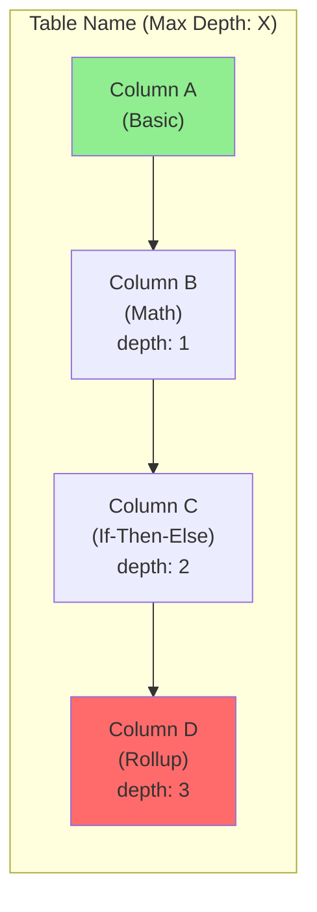
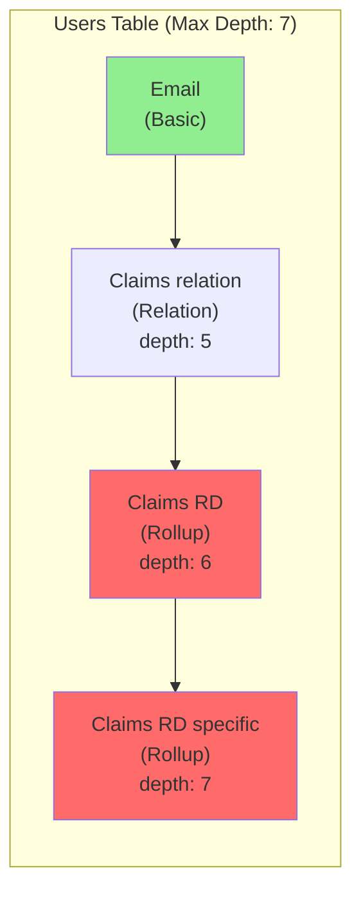

# Fetch App Data Procedure

Extract app data for audit analysis using browser automation and Glide API.

## ⚠️ CRITICAL: Read-Only Operations

**This procedure must ONLY read data. NEVER modify anything:**
- ✅ Navigate, click to view, take snapshots (READ operations)
- ✅ API GET requests only
- ❌ NEVER use Edit, Write, or Delete tools
- ❌ NEVER make API POST/PATCH/PUT/DELETE requests
- ❌ NEVER click Save, Update, or Confirm buttons
- ❌ NEVER modify column settings or app structure

## Overview

This procedure handles the data extraction phase of the audit:
1. Parse app URL to get App ID
2. Navigate to app in browser
3. Extract API token via "Show API" panel
4. Fetch tables and row counts via API (GET requests only)
5. **Inspect computed columns via browser** (API doesn't expose these)
6. **Trace column dependencies** to detect chains
7. **Build dependency data** for Mermaid diagram generation
8. Return structured data for analysis

## Primary Method: API + Browser Inspection

**You MUST use both API and browser inspection for a complete audit.**

The Glide API does NOT expose computed columns. You need:
- **API** for: table list, row counts, basic column info
- **Browser inspection** for: computed column types, dependencies, relations, rollups

---

## Optional: Dev Tools Plugin

**If available**, the Dev Tools plugin can speed up dependency analysis. It's only available to select Glide internal users.

### How to Access Dev Tools

1. Navigate to the app in Glide (any tab: Data, Layout, etc.)
2. Look for the **"Dev tools"** button in the top-right toolbar (next to Share)
3. Click to open the Dev Tools panel

### Overview Panel (Default View)

The main panel shows key metrics at a glance:

| Metric | Description | Audit Use |
|--------|-------------|-----------|
| **Total Columns** | All columns across all tables | App complexity |
| **Visible/Hidden Columns** | Column visibility breakdown | Data organization |
| **Computed** | Number of computed columns | Performance indicator |
| **Max Depth** | Deepest dependency chain | ⚠️ **Critical metric!** Flag if 6+ |
| **Dependency Links** | Total relationships between columns | Complexity indicator |
| **Tables by Type** | Glide Tables, Big Tables, Google Sheets, etc. | Data source breakdown |

### 🔍 Column Dependencies (Most Important for Audits)

Click **"Column Dependencies"** button to see the full dependency analysis.

**Features:**
- **Table-level summary**: Shows each table with dependency count and column breakdown
  - Example: `Users – 31 dependencies | Total columns: 45 (15 Query • 1 Lookup • 16 Other computed • 13 Basic)`
- **Per-column details** (expand table to see):
  - Column name and internal ID
  - Column type (Rollup, Relation, Query, Math, If-Then-Else, Lookup, etc.)
  - "Uses X columns" - direct dependencies
  - **"Total depth: X"** - full chain depth (the key audit metric!)
- **Filters:**
  - Search by column or table name
  - Filter by type: Relation, If-Then-Else, Lookup, Single Value, Math, Rollup, Query
  - **Min Depth filter** - show only columns with depth ≥ N
- **Actions:** Expand all, Quick summary, Compact/Expanded view

**Audit workflow:**
1. Check **Max Depth** in overview - flag if 6+ (critical) or 4+ (warning)
2. Use **Min Depth filter** to find deep chains quickly
3. Expand tables to see which specific columns have high depth
4. Document the deepest chains for the report

### 🔒 Access Control

Click **"Access Control"** to see Row Owner and Role columns.

Shows:
- Row Owner columns (control row-level access)
- Role columns (define user permissions)
- Table location for each
- "Go to Column" navigation button

### 👤 User Specific Columns

Click **"User Specific Columns"** to see columns that store per-user data.

Shows:
- All user-specific columns across tables
- Column type (Boolean, Text, etc.)
- Useful for understanding favorites, user preferences, etc.

### 📊 Table Row Counts

Click **"Table Row Counts"** for comprehensive table data.

Shows:
- **Summary by type**: Glide Tables, Big Tables, Google Sheets, Excel, Airtable, SQL
- **Per-table details**: Name, Type, Row count, Column count, Native Table ID
- **Export to CSV** button for offline analysis
- Search and sort options

**Audit workflow:**
1. Check row counts against plan limits (80%+ = warning, 95%+ = critical)
2. Identify large tables that may need optimization
3. Export to CSV for documentation

---

## API + Browser Data Collection (Required)

**The Glide API does NOT expose computed columns.** You MUST use BOTH methods:

| Data Source | What It Provides | What It Misses |
|-------------|------------------|----------------|
| **API (Show API panel)** | Basic columns (text, number, date, boolean), table IDs, row counts | Computed columns, Relations, Rollups, Lookups, AI columns, Templates |
| **Browser (Data Editor)** | ALL column types including computed, column configurations, dependencies | Less structured, requires manual inspection |

**Audit Requirement:** For accurate analysis, you MUST inspect tables in the Data Editor to identify:
- Computed column types (Math, If-Then-Else, Template, etc.)
- Relation columns and their targets
- Rollup columns and their sources (relation vs table)
- Lookup columns and their sources
- AI columns (Generate Text, Image to Text, etc.)
- Column dependency chains (which computed columns reference other computed columns)

## Prerequisites

- User has provided a Glide app URL
- Browser is authenticated to Glide (user logged in)
- Browser-1 is available for automation

## Input

**Glide App URL** in one of these formats:
- `https://go.glideapps.com/app/abc123def456`
- `go.glideapps.com/app/abc123def456`
- `abc123def456` (just the App ID)

## Output

Structured data object containing:
```javascript
{
  appId: "abc123def456",
  appName: "My App Name",
  apiToken: "glide_api_xxx...xxx",
  tables: [
    {
      tableID: "table123",
      name: "Tasks",
      rowCount: 150,
      columns: [
        {
          id: "col1",
          name: "Title",
          type: "string",
          computedType: null
        },
        {
          id: "col2",
          name: "Status Display",
          type: "computed",
          computedType: "if-then-else",
          dependencies: ["col3", "col4"]
        }
        // ... more columns
      ]
    }
    // ... more tables
  ]
}
```

## ⚠️ Understanding Glide API Column Names

**IMPORTANT:** The Glide API `name` field contains **internal column IDs**, NOT display names.

Example from "Show API" panel:
```javascript
columns: {
  calendarAddId: { type: "string", name: "r4bk7" },
  clientName: { type: "string", name: "Client Name" },
  team: { type: "string", name: "bjkhJ" },
}
```

- The **key** (e.g., `calendarAddId`, `clientName`) is a camelCase identifier generated by Glide
- The **name** field (e.g., `"r4bk7"`, `"Client Name"`) is the internal column ID

Some columns have human-readable IDs (like `"Client Name"`) while others have auto-generated IDs (like `"r4bk7"`, `"bjkhJ"`). This is normal Glide behavior and does **NOT** indicate a naming problem.

**DO NOT flag internal column IDs as "cryptic column names"** - they are not visible to users in the Data Editor UI. The actual display names are set separately and shown properly in the Glide interface.

## Procedure Steps

### Step 1: Parse App URL

Extract App ID from the provided URL.

**Regex patterns**:
```javascript
// Full URL
const pattern1 = /go\.glideapps\.com\/app\/([a-zA-Z0-9]+)/;

// If just ID provided
const pattern2 = /^[a-zA-Z0-9]{12,}$/;
```

**Extraction**:
```javascript
function extractAppId(input) {
  // Try full URL pattern
  const match1 = input.match(/go\.glideapps\.com\/app\/([a-zA-Z0-9]+)/);
  if (match1) return match1[1];

  // Try just ID pattern
  if (/^[a-zA-Z0-9]{12,}$/.test(input)) return input;

  // Invalid format
  throw new Error("Invalid Glide app URL or ID");
}

const appId = extractAppId(userInput);
```

**Validation**:
- App ID should be 12+ alphanumeric characters
- If extraction fails, report error to user

---

### Step 2: Navigate to App

Use browser automation to open the app.

**Target URL**:
```
https://go.glideapps.com/app/{appId}/data
```

**Browser commands**:
```
1. NAVIGATE to https://go.glideapps.com/app/{appId}/data
2. WAIT for page load (selector: Data Editor UI elements)
3. VERIFY login status (if logged out, prompt user to log in)
```

**Expected state**:
- Data Editor is loaded
- Can see table list in left sidebar
- User is authenticated

---

### Step 3: Extract API Token

Use the existing `get-api-key` procedure to extract the API token.

**Reference**: `glide/agents/data/procedures/get-api-key.md`

**Summary of steps** (see full procedure for details):

1. **Select a table** (e.g., Users table or any available table)
2. **Click "Show API" button**
3. **Locate the API token** in the panel:
   - Look for "Bearer {token}" pattern
   - Or find copy button for token
4. **Extract token value**
5. **Close API panel**

**Store token**:
```javascript
const apiToken = extractedToken; // Store for API calls
```

**Validation**:
- Token should be a long alphanumeric string
- Test with API call to `/tables` endpoint

---

### Step 4: Fetch App Name (Optional)

Extract app name from page title or UI.

**Browser command**:
```
SNAPSHOT of page title or app header
Extract app name
```

**Fallback**:
- If can't extract, use "Unnamed App" or leave empty
- App name is for reporting only, not critical

---

### Step 5: Fetch Tables via API

Use Glide API v2 to get all tables.

**API Call**:
```bash
GET https://api.glideapps.com/tables
Authorization: Bearer {apiToken}
Content-Type: application/json
```

**Response**:
```json
{
  "data": [
    {
      "id": "table123",
      "name": "Tasks",
      "rowCount": 150
    },
    {
      "id": "table456",
      "name": "Projects",
      "rowCount": 25
    }
  ]
}
```

**Implementation**:
```javascript
async function fetchTables(apiToken) {
  const response = await fetch('https://api.glideapps.com/tables', {
    method: 'GET',
    headers: {
      'Authorization': `Bearer ${apiToken}`,
      'Content-Type': 'application/json'
    }
  });

  if (!response.ok) {
    throw new Error(`API error: ${response.status}`);
  }

  const data = await response.json();
  return data.data; // Array of tables
}
```

---

### Step 6: Fetch Schema for Each Table

For each table, get detailed column information.

**Note**: Glide API v2 doesn't expose full schema with column types directly. We need to use browser automation to inspect the Data Editor.

**Hybrid approach**:

#### Option A: Browser Inspection (REQUIRED for Computed Columns)

**This is the ONLY way to see computed columns.** The API does not expose them.

For each table:

1. **Navigate to table** in Data Editor:
   ```
   CLICK table in sidebar
   WAIT for table to load
   ```

2. **Identify column types from header icons**:
   - Basic columns: No special icon
   - Computed columns: Show formula/function icon (fx)
   - Relation columns: Show link icon
   - Rollup columns: Show aggregation icon (Σ)
   - Lookup columns: Show lookup icon (→)
   - AI columns: Show sparkle/AI icon (✨)

3. **Inspect computed columns in detail**:
   ```
   For each computed column:
     CLICK column header to select
     LOOK at the column configuration panel on the right
     SNAPSHOT the configuration panel
     Extract:
       - Column name
       - Column type (Math, If-Then-Else, Template, Rollup, Lookup, Relation, AI, etc.)
       - For computed columns: identify which OTHER columns it references
       - For relations: get target table and match columns
       - For rollups: CRITICAL - check if source is a RELATION or a TABLE
       - For lookups: identify the relation column it uses
       - For AI columns: note the AI type (Generate Text, Image to Text, etc.)
     DO NOT click Edit or Save - just read the visible configuration
   ```

4. **Trace dependency chains (CRITICAL)**:
   ```
   For each computed column that references another computed column:
     1. Note the dependency: Column A → Column B
     2. Check if Column B also references other computed columns
     3. Continue tracing until you reach basic columns
     4. Count the depth (number of layers)

   Example chain detection:
   - "Status Display" (Template) → references "Status Emoji"
   - "Status Emoji" (If-Then-Else) → references "Is Overdue"
   - "Is Overdue" (If-Then-Else) → references "Days Until Due"
   - "Days Until Due" (Math) → references "Due Date"
   - "Due Date" (Basic column) → END

   This is a 4-layer chain: Due Date → Days Until Due → Is Overdue → Status Emoji → Status Display
   ```

5. **Build column dependency graph**:
   - For computed columns, identify which columns they reference
   - Create edges in dependency graph
   - Calculate maximum depth from any computed column to basic columns

6. **Document findings per table**:
   ```
   Table: [Name]
   - Total columns: X
   - Basic columns: X
   - Computed columns: X (list types)
   - Relation columns: X (list targets)
   - Rollup columns: X (note if any use tables directly - CRITICAL issue)
   - AI columns: X (list types)
   - Deepest chain: X layers (list the chain)
   ```

#### Option B: API with Limited Data (Faster)

Use API to get basic row data, infer column types:

**API Call**:
```bash
GET https://api.glideapps.com/tables/{tableID}/rows?limit=1
Authorization: Bearer {apiToken}
```

**Response gives**:
```json
{
  "data": [
    {
      "id": "row1",
      "name": "Task 1",
      "status": "Active",
      "dueDate": "2026-01-15T00:00:00Z"
    }
  ]
}
```

**Infer types**:
- String values → Text column
- Number values → Number column
- ISO dates → Date column
- Cannot distinguish computed vs basic columns

**Limitation**: Can't detect computed columns, dependencies, or relations with API alone.

**⚠️ IMPORTANT**: Option B alone produces an **INCOMPLETE AUDIT**. It will:
- Miss all computed columns (Math, If-Then-Else, Template, etc.)
- Miss all relation columns
- Miss rollup misconfiguration issues
- Miss AI column overuse
- Miss dependency chain depth issues

**Recommendation for audit**:
1. **ALWAYS use Option A (Browser Inspection)** for comprehensive analysis
2. Use Option B (API) to supplement with row counts and basic schema
3. Only use Option B alone if browser automation completely fails - but clearly mark the report as "LIMITED ANALYSIS"

---

### Step 7: Build Column Dependency Graph

For computed columns, identify dependencies.

**Example**:
```
Tasks table:
- Due Date (basic) → no dependencies
- Days Until Due (Math: Due Date - Today) → depends on [Due Date]
- Status Display (If-Then-Else: based on Days Until Due) → depends on [Days Until Due]

Graph:
Due Date → Days Until Due → Status Display
```

**Data structure**:
```javascript
const columnGraph = {
  "Due Date": {
    type: "basic",
    dependencies: []
  },
  "Days Until Due": {
    type: "computed",
    computedType: "math",
    dependencies: ["Due Date"]
  },
  "Status Display": {
    type: "computed",
    computedType: "if-then-else",
    dependencies: ["Days Until Due"]
  }
};
```

**Build graph**:
1. Parse column formulas to extract referenced columns
2. For Math columns: extract variable names from formula
3. For If-Then-Else: extract columns used in conditions
4. For Lookups: identify relation column
5. For Rollups: identify relation column (if any)

---

### Step 8: Generate Mermaid Diagram Data

The audit report MUST include a Mermaid diagram showing column dependencies.

**Generate Mermaid syntax** from the dependency graph:



**Diagram generation rules:**
1. **Group by table** using `subgraph TableName["Table Name (Max Depth: X)"]`
2. **Direction**: Use `flowchart BT` (bottom to top) so basic columns are at bottom
3. **Node labels**: Include column name, type, and depth for computed columns
4. **Arrows**: Basic → Computed (dependency direction)
5. **Color coding**:
   - Green (`#90EE90`) for basic columns
   - Yellow (`#FFD700`) for warning depth (4-5)
   - Red (`#FF6B6B`) for critical depth (6+)

**Example from real audit:**


**Focus on problematic chains**: You don't need to diagram every column. Focus on:
- Tables with Max Depth 4+
- The specific chains that are deepest
- Tables with most dependencies

---

### Step 9: Compile and Return Data

Package all extracted data into structured format.

**Final data object**:
```javascript
const appData = {
  appId: "abc123def456",
  appName: "Task Manager",
  apiToken: "glide_api_xxx...xxx",
  auditDate: new Date().toISOString(),
  tables: tables.map(table => ({
    tableID: table.id,
    name: table.name,
    rowCount: table.rowCount,
    columns: extractedColumns[table.id], // From browser inspection
    relations: extractedRelations[table.id],
    ai Columns: countAIColumns[table.id],
    computedColumns: countComputedColumns[table.id]
  }))
};

return appData;
```

---

## Error Handling

### API Token Extraction Fails

**Symptoms**:
- Can't find "Show API" button
- Token not visible in panel
- Copy fails

**Recovery**:
1. Refresh Data Editor page
2. Try different table
3. Check if user has API access (team permissions)
4. Report error to user with instructions

### API Calls Fail (401/403)

**Symptoms**:
- 401 Unauthorized
- 403 Forbidden

**Recovery**:
1. Verify token is correct (not truncated)
2. Check if this is a Big Table app (API v2 only works with Big Tables)
3. Fall back to browser-only analysis (skip API data)
4. Report limited analysis to user

### Browser Automation Fails

**Symptoms**:
- Can't locate elements
- Page structure changed
- Timeout errors

**Recovery**:
1. Take snapshot, describe what's visible
2. Try alternative selectors
3. Skip detailed column analysis if necessary
4. Proceed with API-only data (limited)

### App Not Found (404)

**Symptoms**:
- App URL doesn't load
- 404 error

**Recovery**:
1. Verify App ID is correct
2. Check if user has access to this app
3. Report error to user

---

## Performance Considerations

### Large Apps (50+ Tables)

For apps with many tables:
- Fetching all table schemas can take 5-10 minutes
- Consider progress updates to user
- Implement batching (analyze 10 tables at a time)

**Progress reporting**:
```
Analyzing app structure...
- Extracted API token ✓
- Found 57 tables
- Analyzing tables: 10/57 (18%)
- Analyzing tables: 20/57 (35%)
...
```

### API Rate Limiting

Glide API may have rate limits:
- Throttle requests (1 per second)
- Batch operations where possible
- Cache results

### Browser Timeout

Data Editor may be slow for large tables:
- Increase timeouts for table loading
- Wait for column panels to fully load
- Add retries for failed interactions

---

## Example Execution

```javascript
// User provides URL
const userInput = "https://go.glideapps.com/app/abc123def456";

// Step 1: Parse
const appId = extractAppId(userInput);
console.log(`App ID: ${appId}`);

// Step 2-3: Browser automation
await navigateToDataEditor(appId);
const apiToken = await extractAPIToken();
console.log(`API Token: ${apiToken.substring(0, 10)}...`);

// Step 5: Fetch tables
const tables = await fetchTables(apiToken);
console.log(`Found ${tables.length} tables`);

// Step 6-7: Inspect columns
const detailedTables = [];
for (const table of tables) {
  console.log(`Analyzing table: ${table.name}...`);
  const columns = await inspectTableColumns(table.id);
  const graph = buildDependencyGraph(columns);
  detailedTables.push({
    ...table,
    columns,
    dependencyGraph: graph
  });
}

// Step 8: Return
return {
  appId,
  apiToken,
  tables: detailedTables
};
```

---

## Output for Next Procedure

The extracted data is passed to:
- **analyze-data-structure.md** - For performance analysis
- **analyze-layout.md** - For UI analysis (needs browser still open)

---

## References

- [Get API Key Procedure](../../../agents/data/procedures/get-api-key.md)
- [Glide API v2 Documentation](https://apidocs.glideapps.com/api-reference/v2/general/introduction)
- [Data Modeling Skill](../../data-modeling/SKILL.md)
